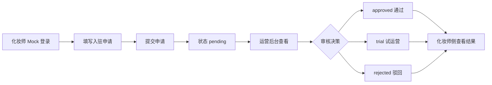
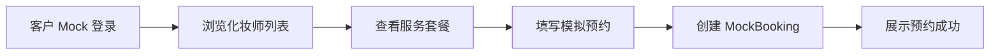
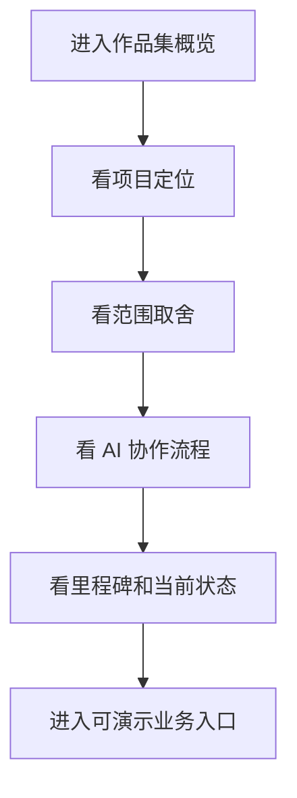

# PRD_BeautyGo_AI产品经理作品集 v1.0

- 版本：`v1.0`
- 日期：`2026-05-16`
- 文档定位：AI 产品经理作品集 PRD / 准上线 MVP 规格
- 当前源文件：本文件是后续开发的唯一 PRD 源文件
- 历史资料：`PRD_上门美妆平台_BeautyGo_v0.2.md` 保留为商业化版本历史参考

## 1. 文档摘要

BeautyGo 从“真实商业化上门美妆平台”收束为“求职面试向 AI 产品经理作品集项目”。项目继续使用上门美妆 O2O 作为业务载体，但目标不再是融资、扩城和真实商业运营，而是展示一个 AI 产品经理如何完成从机会判断、需求收束、PRD、流程设计、AI 协作研发、MVP 验收到复盘表达的完整能力链路。

最终形态按 `准上线 MVP` 处理：保留可运行的前端、后台、API、核心业务闭环和验收标准；不接入真实支付、实名认证、即时通讯、短信、地图派单、保险和多城市运营系统。

## 2. 项目定位

### 2.1 一句话定位

BeautyGo 是一个 AI 产品经理作品集项目，用上门美妆 O2O 作为业务载体，展示从产品判断、需求文档、业务流程、研发协作到可运行 MVP 的完整产品能力。

### 2.2 目标受众

| 受众 | 他们想看到什么 | BeautyGo 对应展示 |
| --- | --- | --- |
| 面试官 | 候选人是否能把模糊商业想法收束成可落地产品 | PRD 收束、范围取舍、验收标准 |
| 招聘方 PM Leader | 候选人是否理解研发协作与优先级管理 | Milestone、任务包、Claude Code 协作协议 |
| 技术面试官 | 需求是否能映射为清晰数据结构和接口边界 | monorepo、domain-types、API、测试 |
| 非技术 HR | 项目是否易理解、有完整故事线 | 作品集展示层、3 分钟项目摘要 |

### 2.3 核心展示目标

1. 展示产品经理的业务抽象能力：能把“上门美妆”拆成角色、场景、流程、规则和指标。
2. 展示需求收束能力：能从完整商业项目中主动砍掉当前阶段不需要的高成本能力。
3. 展示 AI 协作能力：能让 Codex 负责需求、计划、验收，让 Claude Code 负责代码实现。
4. 展示可落地能力：项目不是静态文档，而是能本地运行、能演示、能验证主流程。
5. 展示复盘能力：能说明做了什么、为什么这样做、还没做什么、下一步如何推进。

## 3. 为什么从商业平台收束为作品集

### 3.1 原商业化版本的问题

旧版 PRD 覆盖了上门美妆真实平台所需的大量能力，包括支付、结算、纠纷、履约、供给治理、城市运营和商业增长。这套设计适合创业立项，但对个人作品集来说存在三个问题：

1. 资金和资源不匹配：真实平台需要供应商、支付资质、客服、保险、城市运营与推广预算。
2. 交付周期过长：完整商业闭环会稀释作品集最应该展示的产品判断和 MVP 落地能力。
3. 面试信息密度不足：面试官更需要快速理解候选人的方法、取舍和协作能力，而不是看一个过大的创业计划。

### 3.2 新版本的收束原则

| 原能力 | 新版本处理 | 原因 |
| --- | --- | --- |
| 真实支付 | 模拟预约，不收款 | 避免资质和合规成本，保留交易意图 |
| 实名认证 | 入驻资料模拟审核 | 展示审核流程，不处理真实隐私数据 |
| IM 聊天 | 预留沟通字段或静态说明 | MVP 不需要实时通信服务 |
| 地图派单 | 使用城市和服务区域字段模拟 | 展示匹配逻辑，不接地图供应商 |
| 多城市运营 | 单城市样例 | 聚焦可演示闭环 |
| 融资计划 | 删除 | 作品集不以融资为目标 |
| 商业扩张 | 改为下一步路线图 | 保留产品思考，不作为当前承诺 |

## 4. MVP 范围

### 4.1 功能主线

| 主线 | 目标 | MVP 结果 |
| --- | --- | --- |
| 客户侧 | 让面试官看到客户如何发现服务并发起预约 | 浏览化妆师、查看服务套餐、发起模拟预约 |
| 化妆师侧 | 让面试官看到供给入驻和状态流转 | 提交入驻申请、配置基础资料、查看审核状态 |
| 运营后台 | 让面试官看到平台如何管理供给 | 审核申请、更新状态、查看基础运营看板 |
| 作品集展示层 | 让面试官快速理解项目价值 | 项目概览、PRD 摘要、AI 协作流程、里程碑复盘 |

### 4.2 明确不做

1. 不做真实支付、退款、结算和财务对账。
2. 不做真实实名认证、人脸识别和证件存储。
3. 不做真实 IM、语音、短信和推送。
4. 不做真实地图定位、路径规划和派单。
5. 不做真实保险、客服仲裁和法律协议闭环。
6. 不做真实多城市运营、地推、补贴和商业投放。
7. 不做融资 BP、投资人材料和商业规模化模型。

### 4.3 MVP 成功标准

| 类型 | 标准 |
| --- | --- |
| 理解效率 | 面试官 3 分钟内理解项目背景、产品决策、AI 协作方式和当前能力 |
| 可运行性 | 本地执行 `pnpm dev` 后可访问客户侧、化妆师侧、后台侧 |
| 主流程 | 入驻申请、后台审核、客户浏览与模拟预约可演示 |
| 工程质量 | `pnpm typecheck`、`pnpm build`、核心测试通过 |
| 文档质量 | PRD、开发计划、README 能支撑后续任务拆解 |

## 5. 用户角色

### 5.1 客户

客户是模拟服务需求方，核心诉求是快速找到风格合适、价格清楚、状态可信的化妆师。MVP 中客户不需要真实注册和付款，通过 Mock 登录进入客户侧体验。

关键行为：

1. 浏览化妆师卡片。
2. 查看化妆师详情和服务套餐。
3. 选择场景、时间和备注。
4. 发起模拟预约并看到预约结果。

### 5.2 化妆师

化妆师是模拟供给方，核心诉求是提交资料并知道平台审核状态。MVP 不做真实身份校验，但要求资料字段足以展示产品经理对供给审核的理解。

关键行为：

1. 以化妆师角色登录。
2. 填写入驻申请。
3. 提交作品集、服务场景、城市和经验年限。
4. 查看审核状态和运营反馈。

### 5.3 运营管理员

运营管理员用于展示平台治理能力。MVP 中管理员通过 Mock 登录进入后台，审核化妆师申请并查看基础看板。

关键行为：

1. 查看申请列表。
2. 按状态识别待处理申请。
3. 审核通过、驳回或进入试运营。
4. 查看基础统计数据。

### 5.4 面试官

面试官是作品集展示层的核心用户。面试官不一定实际使用业务流程，但需要快速理解项目为什么做、怎么收束、现在做到哪里、AI 如何参与研发。

关键行为：

1. 查看项目摘要。
2. 查看核心流程图和范围取舍。
3. 查看 AI 协作说明。
4. 查看里程碑、当前状态和下一步计划。

## 6. 信息架构

### 6.1 super-app

| 页面 | 面向角色 | 内容 | 关键动作 |
| --- | --- | --- | --- |
| 首页 / 作品集概览 | 面试官、客户、化妆师 | 项目定位、当前里程碑、入口导航 | 切换角色、进入业务流程 |
| 客户发现页 | 客户 | 化妆师列表、场景筛选、价格区间 | 查看详情、发起预约 |
| 化妆师详情页 | 客户 | 作品集、套餐、评分、服务区域 | 选择套餐 |
| 模拟预约页 | 客户 | 预约时间、场景、备注、模拟价格 | 提交预约 |
| 化妆师入驻页 | 化妆师 | 入驻资料表单 | 提交申请 |
| 化妆师状态页 | 化妆师 | 审核状态、运营备注、下一步说明 | 查看反馈 |

### 6.2 admin-web

| 页面 | 内容 | 关键动作 |
| --- | --- | --- |
| 运营看板 | 申请总数、待审核数、试运营数、状态分布 | 查看当前 MVP 数据 |
| 化妆师审核台 | 申请列表、申请详情、作品集、审核备注 | 通过、驳回、试运营 |
| 作品集项目说明 | PRD 摘要、AI 协作、阶段复盘 | 辅助面试讲解 |

### 6.3 API

| 模块 | 责任 |
| --- | --- |
| auth | Mock 登录、Mock Session、角色识别 |
| artist-applications | 入驻申请创建、查询、审核状态更新 |
| portfolio | 项目信息、里程碑、作品集摘要，可先静态化 |
| bookings | 模拟预约创建、列表与状态展示，后续阶段实现 |

## 7. 核心对象

### 7.1 ArtistApplication

用于表达化妆师入驻申请，是当前已实现主线的核心对象。

关键字段：

1. `id`：申请 ID。
2. `applicantName`：申请人姓名。
3. `cityId`：服务城市。
4. `phone`：联系方式，MVP 仅做格式和长度限制。
5. `bio`：个人简介。
6. `experienceYears`：从业年限。
7. `primaryScenes`：服务场景。
8. `portfolio`：作品集。
9. `status`：`pending` / `approved` / `rejected` / `trial`。
10. `reviewerNote`：运营审核备注。
11. `createdByUserId`、`reviewedByUserId`：用于展示权限和审计意识。

### 7.2 ArtistProfile

用于客户侧浏览展示，MVP 可先使用模拟数据，后续再从审核通过的申请生成。

关键字段：

1. `id`、`displayName`、`cityId`。
2. `avatarUrl`、`portfolioImages`。
3. `scenes`、`tags`、`experienceYears`。
4. `rating`、`reviewCount`。
5. `servicePackages`。
6. `availabilitySummary`。

### 7.3 ServicePackage

用于表达客户可预约的服务套餐。

关键字段：

1. `id`、`artistId`。
2. `scene`：旅拍写真、聚会晚宴、面试商务、婚礼宾客。
3. `name`、`durationMinutes`、`priceYuan`。
4. `includesHair`、`materialsPolicy`。
5. `description`。

### 7.4 MockBooking

用于展示客户侧模拟预约闭环，不做支付和真实履约。

关键字段：

1. `id`、`customerUserId`、`artistId`、`packageId`。
2. `scene`、`appointmentDate`、`appointmentTime`。
3. `cityId`、`addressArea`、`note`。
4. `status`：`created` / `confirmed` / `cancelled`。
5. `createdAt`、`updatedAt`。

## 8. 核心流程

### 8.1 化妆师入驻与审核

验收标准：

1. 化妆师提交资料后能在列表中看到自己的申请。
2. 管理员能看到全部申请。
3. 管理员能更新状态并填写备注。
4. 化妆师只能看到自己提交的申请。

### 8.2 客户模拟预约

验收标准：

1. 客户能看到至少 3 个模拟化妆师。
2. 客户能基于套餐发起预约。
3. 预约成功后展示预约编号、时间、套餐和状态。
4. 不出现真实支付入口。

### 8.3 作品集展示

验收标准：

1. 首页能解释项目不是融资 BP，而是 AI PM 作品集。
2. 页面能展示 Codex 与 Claude Code 分工。
3. 页面能说明当前已完成和下一步计划。
4. 面试官无需阅读完整 PRD 也能理解项目亮点。

## 9. AI 协作研发模式

### 9.1 分工

| 角色 | 职责 |
| --- | --- |
| Codex | 产品定位、PRD、阶段计划、任务拆解、验收标准、代码审查、提交说明 |
| Claude Code | 代码实现、重构、测试、页面交互、缺陷修复 |
| 用户 | 目标确认、方向取舍、GitHub 权限、本地运行反馈、面试偏好 |

### 9.2 任务交接格式

每个交给 Claude Code 的任务必须包含：

1. 当前目标。
2. 写入范围。
3. 禁止事项。
4. 涉及文件。
5. 验收标准。
6. 测试命令。
7. 中文提交说明建议。

### 9.3 审查规则

Claude Code 返回后，Codex 必须：

1. 审查 diff 是否符合 PRD。
2. 检查是否引入不在 MVP 范围内的真实支付、实名、IM、地图等能力。
3. 跑 `pnpm typecheck`、`pnpm build` 和相关测试。
4. 必要时本地打开页面或调用 API 验证主流程。
5. 用中文总结进度、风险和下一步。

## 10. 指标与验收

### 10.1 作品集指标

| 指标 | 目标 |
| --- | --- |
| 3 分钟理解度 | 面试官能复述项目定位、用户角色、MVP 主线 |
| 可演示主线数 | 至少 3 条：入驻审核、客户预约、作品集概览 |
| 文档到代码一致性 | PRD、README、页面文案不冲突 |
| AI 协作可解释性 | 能说明 Codex 和 Claude Code 如何分工 |

### 10.2 工程验收

1. `pnpm install` 能完成依赖安装。
2. `pnpm dev` 能启动 API、客户/化妆师入口和后台入口。
3. `pnpm typecheck` 通过。
4. `pnpm build` 通过。
5. API 核心测试通过。

### 10.3 MVP 验收 Checklist

| 编号 | 项目 | 状态口径 |
| --- | --- | --- |
| M1 | 新 PRD 与开发计划完成 | 文档存在且 README 指向新源文件 |
| M2 | 代码健康修复完成 | 类型、DI、环境变量、基础测试通过 |
| M3 | 作品集概览页完成 | 面试官 3 分钟可理解 |
| M4 | 客户模拟预约完成 | 不含真实支付 |
| M5 | 化妆师入驻审核闭环完成 | 已具备，需继续打磨展示 |
| M6 | 后台看板完成 | 展示申请状态和基础数据 |
| M7 | 演示材料完成 | README、截图、讲解脚本、复盘 |

## 11. 里程碑

### Milestone 1：产品收束与代码健康

目标：完成新 PRD、开发计划、README 更新，并修复 Claude Code 审查中影响后续开发的基础问题。

验收：

1. 新 PRD 和开发计划存在。
2. 旧 PRD 标记为历史资料。
3. 类型来源收敛到 `domain-types`。
4. DI、环境变量、CORS、输入长度限制和基础测试完成。

### Milestone 2：作品集展示层

目标：让面试官进入项目后能快速理解 BeautyGo 的项目价值。

验收：

1. 首页展示项目定位、范围取舍、AI 协作和里程碑。
2. 业务入口清晰区分客户、化妆师和后台。
3. 页面文案符合“作品集项目”定位。

### Milestone 3：客户模拟预约

目标：补齐客户侧可演示主线。

验收：

1. 客户能浏览化妆师和套餐。
2. 客户能创建模拟预约。
3. 预约状态可展示。
4. 不包含真实支付和真实地址隐私。

### Milestone 4：后台看板与演示收尾

目标：形成可用于求职面试的完整展示材料。

验收：

1. 后台看板能展示基础运营数据。
2. README 包含运行指南、演示路径和项目亮点。
3. 补充面试讲解脚本和阶段复盘。

## 12. 风险与边界

| 风险 | 处理策略 |
| --- | --- |
| 项目看起来像未完成创业项目 | 所有入口文案强调作品集定位 |
| 技术实现过度扩张 | PRD 明确不做真实第三方服务 |
| AI 协作不可见 | 在页面和文档中展示任务协议、分工和验收 |
| 代码质量影响展示 | 先处理类型、DI、环境和测试 |
| 页面像模板项目 | 后续 UI 打磨要有明确视觉方向，避免默认后台感 |

## 13. 后续非目标路线图

以下能力只作为面试讨论材料，不进入当前 MVP：

1. 真实支付、结算、退款和纠纷仲裁。
2. 真实实名认证和供应商接入。
3. 地图服务、派单、抢单和路线规划。
4. 内容社区、营销系统和会员体系。
5. 多城市经营模型和商业投放。

这些内容可以在面试中作为“如果有团队和预算，下一阶段会如何推进”的产品思考，但不会消耗当前开发周期。
